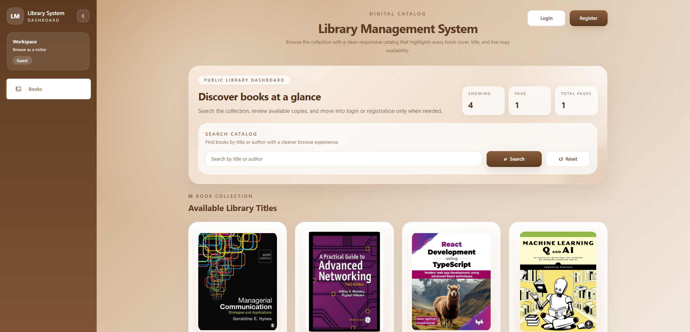
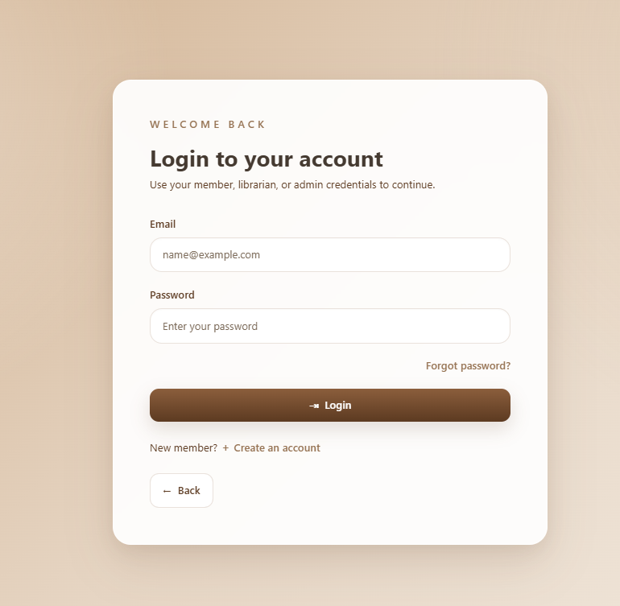
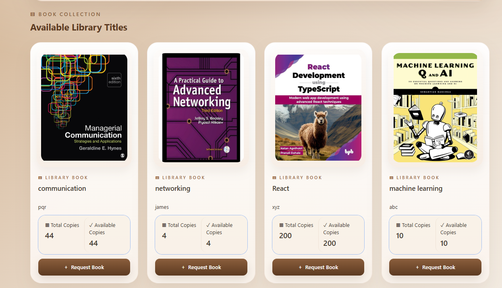
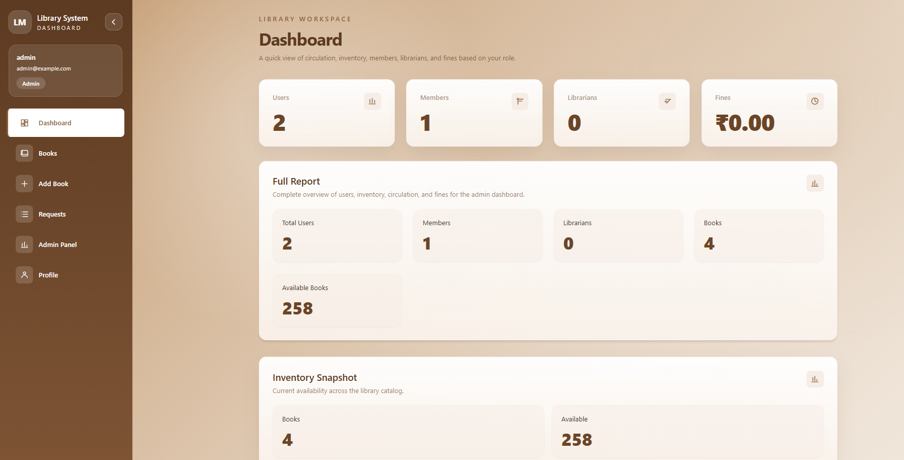
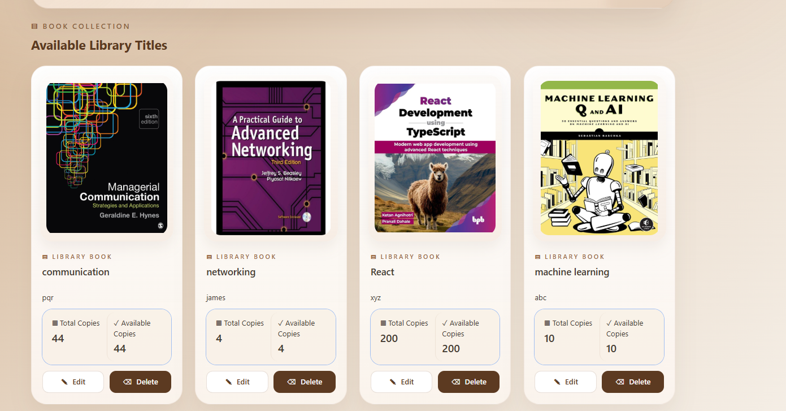
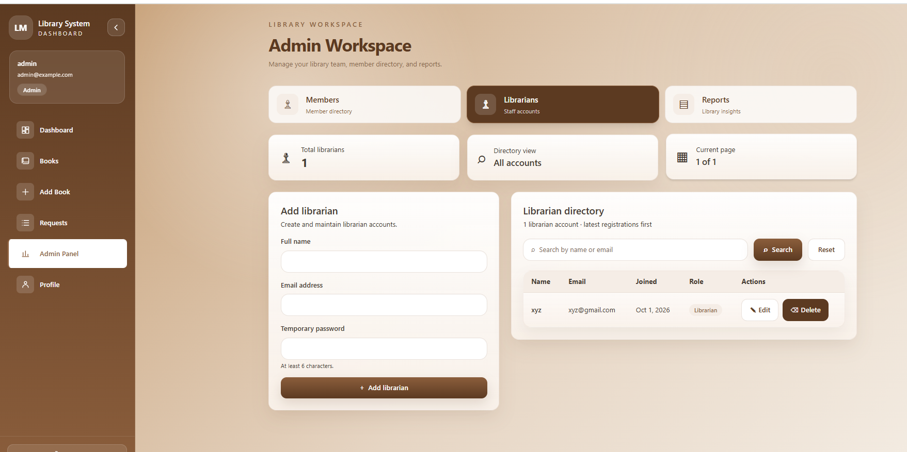
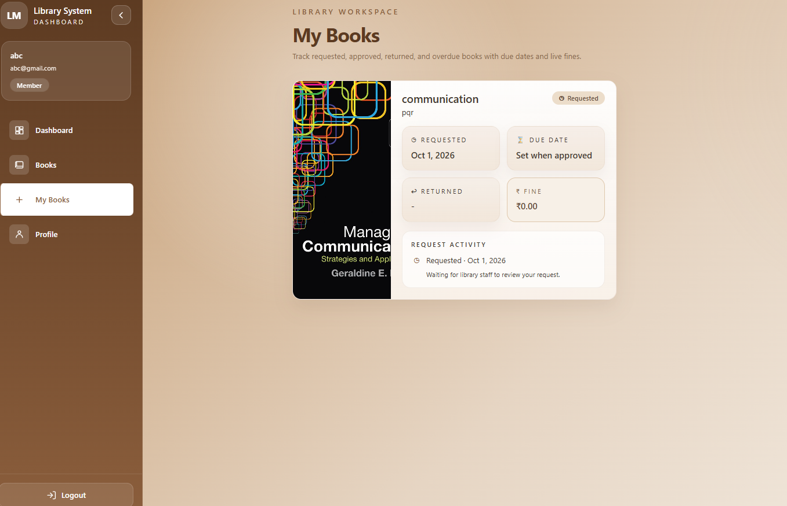
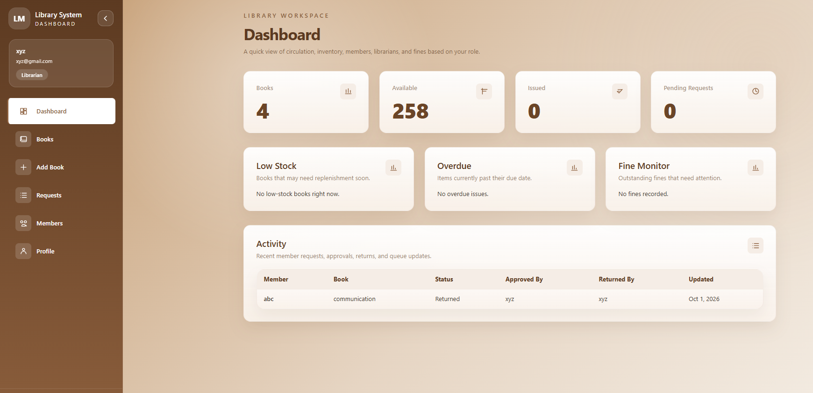

# Library Management System

A full-stack library management app built with MongoDB, Express, React, and Node.js.

## Overview

The app supports library members, librarians, and admins. Members can find books and request them; library staff can manage the catalog and borrowing process.

## Features

- Browse and search the book catalog
- Register and sign in as a member
- Request books and track borrowing status
- Let librarians manage books, requests, and returns
- Track overdue books and fines
- Let admins manage accounts and download a PDF report

## Tech Stack

- React, Vite, and Tailwind CSS
- Node.js and Express
- MongoDB and Mongoose
- JSON Web Tokens

## Screenshots

()

()








## Project Structure

```text
library_management/
├── backend/
│   ├── config/
│   ├── controllers/
│   ├── middleware/
│   ├── models/
│   ├── routes/
│   └── services/
├── frontend/
│   └── src/
│       ├── components/
│       ├── pages/
│       ├── routes/
│       └── services/
├── screenshots/
└── README.md
```

## Getting Started

You’ll need Node.js and MongoDB.

1. Clone the repository:

   ```bash
   git clone https://github.com/davenaiya/library_management.git
   ```

2. Set up the backend:

   ```powershell
   cd library_management/backend
   npm install
   Copy-Item .env_example .env
   ```

3. Edit `backend/.env` with your local settings. Keep this file private.

4. Start the backend:

   ```powershell
   npm run dev
   ```

5. In a second terminal, set up and start the frontend:

   ```powershell
   cd library_management/frontend
   npm install
   npm run dev
   ```

## Developer

- [Naiya Dave](https://github.com/davenaiya)

## Version

1.0.0